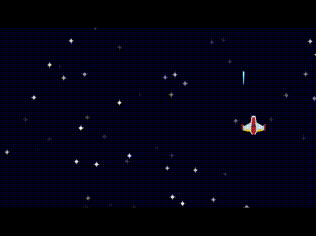

# Naga [WIP]
A framework for [Love2D](https://love2d.org/), heavily inspired by [DragonRuby](https://dragonruby.org/).

## Features
- A single `tick` function that replaces `load`, `update`, and `draw`
- Live-reload on file save (currently only reloads `main.lua`)
- Full access to the Love2D engine and it's ecosystem

## Installation

To install simply copy `naga.lua` into your game folder. Then add the following require to the top of your `main.lua`.

```lua
local naga = require "naga"
```

## Example Usage

<p align="center">
  
</p>

```lua
local naga = require "naga"

function naga.tick(args)
  love.graphics.clear(0, 0, 0.1) -- Background color of game
  naga.music("assets/music.ogg", 0.5) -- Looping background music.

  -- Create 50 randomly positioned stars.
  local stars = args.state:init("stars", {})
  while #stars < 50 do
    table.insert(stars, {x = love.math.random() * 1280,
                         y = love.math.random() * 720,
                         z = love.math.random()})
  end

  -- Move stars with wraparound and draw.
  for _, star in ipairs(stars) do
    star.y = (star.y + star.z) % (720 + 24)

    love.graphics.setColor(1, 1, 1, star.z)
    love.graphics.draw(naga.image("assets/star.png"),
      star.x, star.y, 0, 1, 1, 25 / 2, 24)
    love.graphics.setColor(1, 1, 1, 1)
  end

  -- Lasers that move upwards when fired.
  local lasers = args.state:init("lasers", {})
  for _, laser in ipairs(lasers) do
    laser.y = laser.y - 20
    love.graphics.draw(naga.image("assets/laser.png"),
      laser.x, laser.y, 0, 1, 1, 9 / 2, 54 / 2)
  end

  -- Create a ship that is moved with the arrow keys.
  local ship = args.state:init("ship", {x = 1280 / 2, y = 720 / 2})
  ship.x = ship.x + (args.keys.held.right and 10 or 0) - (args.keys.held.left and 10 or 0)
  ship.y = ship.y + (args.keys.held.down and 10 or 0) - (args.keys.held.up and 10 or 0)

  -- Draw the ship.
  love.graphics.draw(naga.image("assets/ship.png"), ship.x, ship.y, 0, 1, 1, 99 / 2, 75 / 2)

  -- Shoot lasers with space.
  if args.keys.pressed.space then
    table.insert(lasers, {x = ship.x, y = ship.y - 40})
    naga.sound("assets/laser.ogg")
  end
end
```
