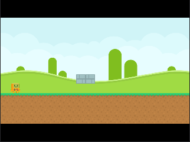

# Naga [WIP]
A framework for [Love2D](https://love2d.org/), heavily inspired by [DragonRuby](https://dragonruby.org/).

## Features
- A single `tick` function that replaces `load`, `update`, and `draw`
- Live-reload on file save (currently only reloads `main.lua`)
- An in-game console that you can use to inspect / manipulate state
- Configureable resolution with optional pixel-perfect mode
- Full access to the Love2D engine and it's ecosystem

## Installation

To install, run `git submodule add https://github.com/rameshvarun/naga.git naga` in the same directory as your main.lua.

```lua
local naga = require "naga"
```

## Examples

### Space Shooter Example

<p align="center">
  
</p>

```lua
local naga = require "naga" -- Load naga
local vec, color, util = naga.vec, naga.color, naga.util -- Shortcuts

function naga.tick(args)
  color(0, 0, 0.1):clear() -- Background color of game
  naga.music("assets/music.ogg", 0.5) -- Looping background music

  -- Create 50 randomly positioned stars on screen
  local stars = args.state:init("stars", function ()
    return util.map(util.range(50), function ()
      return { pos = vec.random(vec(1280, 720)), depth = love.math.random() }
    end)
  end)

  -- Move stars with wraparound and draw
  for _, star in ipairs(stars) do
    star.pos.y = (star.pos.y + star.depth) % (720 + 24)
    naga.sprite("assets/star.png", star.pos, {
      origin = vec(0.5, 1), color = color(1, 1, 1, star.depth) })
  end

  -- Lasers that move upwards when fired
  local lasers = args.state:get("lasers", {})
  for _, laser in ipairs(lasers) do
    laser:translate(0, -20)
    naga.sprite("assets/laser.png", laser, { origin = vec(0.5, 0.5) })
  end

  -- Create a ship that is moved with the arrow keys
  local ship = args.state:get("ship", vec(1280 / 2, 720 / 2))
  ship:translate(args.keys.arrows * 10) -- Move ship by arrow keys vector
  ship:clamp(vec(0, 0), vec(1280, 720)) -- Clamp ship on screen
  naga.sprite("assets/ship.png", ship, { origin = vec(0.5, 0.5) }) -- Draw ship

  -- Shoot lasers with space.
  if args.keys.pressed.space then
    table.insert(lasers, ship:translated(0, -40))
    naga.sound("assets/laser.ogg")
  end
end
```

### Platformer Example

<p align="center">
  
</p>

```lua
local naga = require "naga"
local vec = naga.vec

local map = naga.tilemap.parse [[
00000000000000000000
00000000000000000000
00000000000000000000
00000000000000000000
00000000000000000000
00000000000000000000
00000000330000000000
00000000000000000000
11111111111111111111
22222222222222222222
22222222222222222222
22222222222222222222
]]

function naga.tick(args)
  -- Draw the background.
  naga.sprite("assets/background.png", vec(0, -250))
  naga.sprite("assets/background.png", vec(1024, -250))

  -- Draw the level.
  naga.tilemap.draw(map, 64, {"assets/grass-top.png", "assets/dirt.png", "assets/block.png"})

  -- Draw the character.
  naga.sprite("assets/character.png", vec(100, 7 * 64 + 16), {origin = vec(0.5, 0.5)})
end
```
